# Sabeel Institute Time Tracker — User Manual

*For app version 1.0.0-beta.17 · July 2026*

Welcome! This guide explains everything you can do in the Sabeel Institute Time
Tracker — from logging your first hour to approving your team's timesheets. It is
organized by role: **everyone** starts with Part 1; **managers/approvers** add
Part 2; **admins** add Part 3. Part 4 is a quick "How do I…?" index you can skim
any time.

The app works the same on the website
(https://sabeel-institute-time-tracker.web.app) and the Android app — same
account, same data, live everywhere.

---

## The big picture (2 minutes)

1. **You log hours** against an *activity* — either by clocking in and
   out while you work, or by adding hours manually afterwards. Every hour
   belongs to a **week** (Sunday to Saturday, never crossing a month boundary —
   so the first or last week of a month can be short).
2. **At the end of the week you submit a timesheet.** That freezes the week and
   sends it to your **approver** — a manager you pick once, in the app.
3. **Your approver approves it** (it becomes official and counts in reports) or
   **rejects it with a reason** (it comes back to you to fix and resubmit).
4. **Official reports count approved timesheets only.** Until a week is
   approved, its hours exist but aren't part of the official record.

That's the whole system. Everything below is detail.

---

# Part 1 — For everyone

## 1.1 Signing in

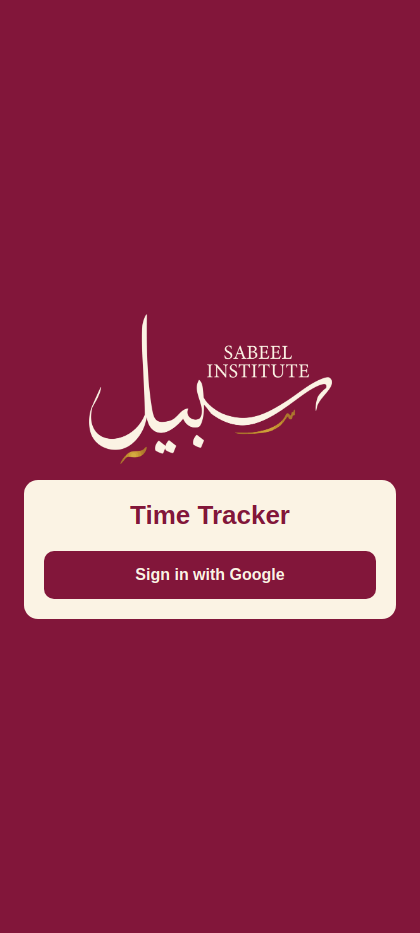

Open the app or website and tap **Sign in with Google**. Google's account
chooser appears — pick your account (or "Use another account" to switch).
There are no passwords to remember; access is entirely through your Google
account.

### First time? You'll wait for approval

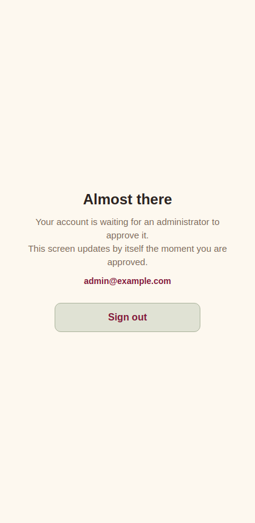

New accounts land on an **"Almost there"** screen. An administrator has to
approve your account before you can use the app — this screen updates by
itself the moment they do, no refresh needed. If you seem stuck here, contact
your admin.

## 1.2 Your home screen

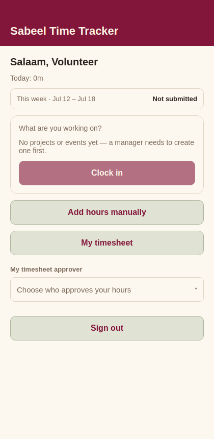

From top to bottom:

- **Today's total** — hours logged so far today.
- **This week strip** — the current week's dates and its timesheet status
  (*Not submitted*, *Awaiting approval*, *Approved*, or *Rejected*). Tap it to
  open the week.
- **Clock in card** — pick what you're working on and clock in.
- **Add hours manually / My timesheet** — the other two things you'll use daily.
- **My timesheet approver** — who approves your weeks (see 1.5).
- **Notification settings** — choose which push notifications you get (see 1.9).
- If a timesheet of yours was rejected, a **red banner** appears at the very
  top — tap it to fix things (see 1.7).

Managers and admins see extra buttons here (Approvals, Reports, Activities,
Manage users) — covered in Parts 2 and 3.

## 1.3 Logging hours

### Clocking in and out (live tracking)

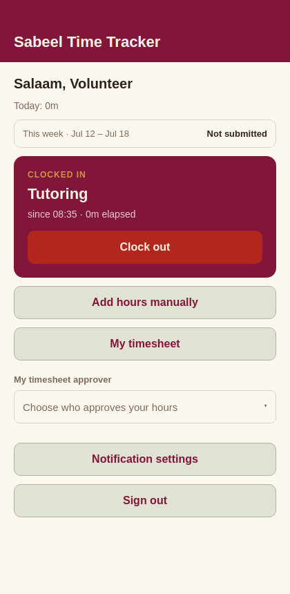

1. On Home, tap **Pick an activity**, search or scroll, tap one.
2. Tap **Clock in**. The raspberry card shows what you're working on and a
   running clock.
3. When you finish, tap **Clock out**. The session becomes an entry on today's
   timesheet.

Good to know:

- You can only have **one running session** at a time.
- Forgot to clock out? Sessions are **automatically closed after 12 hours**
  and marked "auto-closed" — edit the entry afterwards to correct the times.
- The app reminds you on-screen once a session passes 8 hours.

### Adding hours manually

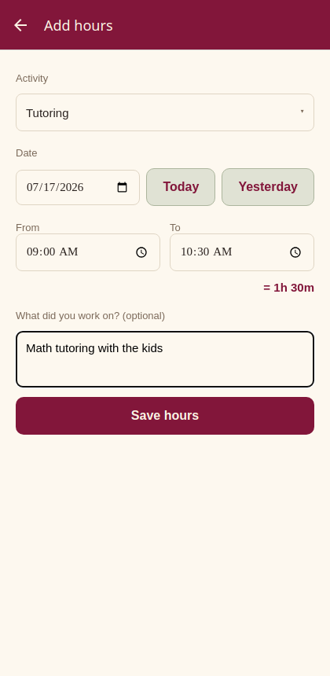

For work you didn't clock (yesterday's event, off-site work):

1. Home → **Add hours manually**.
2. Pick the activity, the date (**Today** / **Yesterday** shortcuts, or the
   date picker), and the from/to times with the time pickers.
3. Watch the **"= 8h 00m"** line under the times — it shows the duration you're
   about to save, so AM/PM mistakes jump out before you save.
4. Optionally describe what you did, then **Save hours**.

### Copying last week

If your weeks look alike: open an **empty** week in My timesheet and tap
**"Copy last week's hours"**. Every entry from the previous week is copied to
the same weekday and time, ready to adjust. (Only offered while the week has
no entries yet.)

## 1.4 Your timesheet week by week

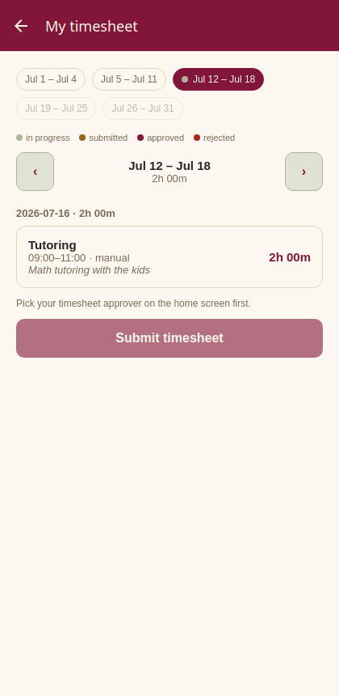

Home → **My timesheet**. What you're looking at, top to bottom:

- **The month and year**, with **‹ › arrows** that step month by month.
- **Week chips** — one per week of the month; tap a chip to open that week.
  The colored dots are a status legend (also printed right below the chips):
  - **sage/green dot** — hours logged, not submitted yet (work in progress)
  - **gold dot** — submitted, awaiting the approver
  - **raspberry dot** — approved (final)
  - **red dot** — rejected (needs your attention)
  - **no dot** — empty week
- **Week total** — the selected week's hours, with its status next to it.
- **Day groups** — each day's entries with times and durations. **Tap an entry
  to edit or delete it** (activity, date, times, note).
- Future weeks are dimmed — there's nothing to do there yet. Wandered off?
  **Jump to current week** brings you back.

### Overlapping entries

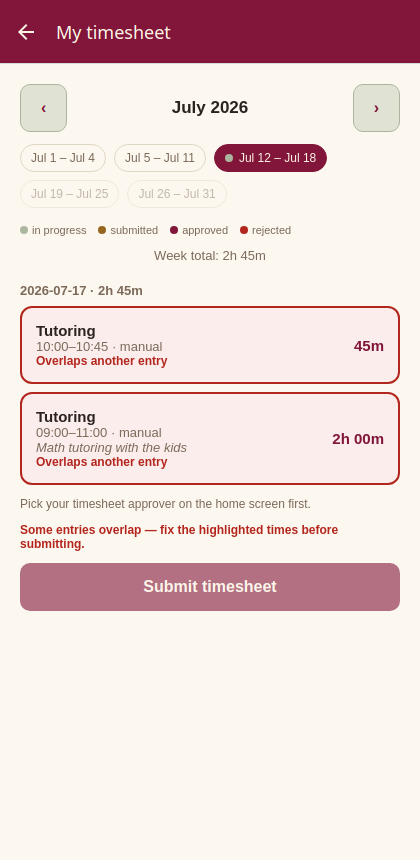

Two entries on the same day whose times overlap are **highlighted in red**
("Overlaps another entry") — usually a double-log or an AM/PM slip. A week
with overlaps **can't be submitted** until you fix the times (tap an entry to
edit it). Back-to-back entries are fine: one ending at 2:00 PM and the next
starting at 2:00 PM don't overlap.

## 1.5 Picking your approver (one-time setup)

Before your first submission, tell the app who approves your hours: on Home,
under **My timesheet approver**, tap the selector and pick from the list of
managers. This is sticky — it applies to all future submissions until you
change it. Changing it never affects a timesheet you've already submitted.

*Can't submit and see "Pick your timesheet approver on the home screen
first"?* This is why.

## 1.6 Submitting your week

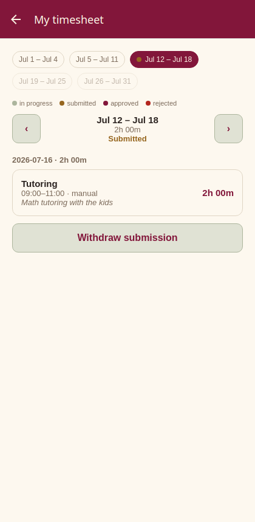

1. Open the week in **My timesheet** and give it a once-over.
2. Tap **Submit timesheet**. The status turns **Submitted** (gold) and the
   week **locks** — you can't add or edit entries while your approver has it.
3. Change your mind? **Withdraw submission** unlocks it (only until it's
   approved).

Rules of thumb:

- You can submit the **current week early** (say, Friday) — but you can't log
  more hours into it afterwards without withdrawing first. If you're clocked
  in, clock out before submitting.
- **Overlapping entries block submission** (see 1.4) — fix the highlighted
  times first.
- **Past weeks can be submitted any time, in any order.** No deadlines.
- **Empty weeks can be submitted too** ("Submit timesheet (no hours)") — useful
  to close out a week you were away.
- Future weeks can't be submitted.

## 1.7 When a timesheet is rejected

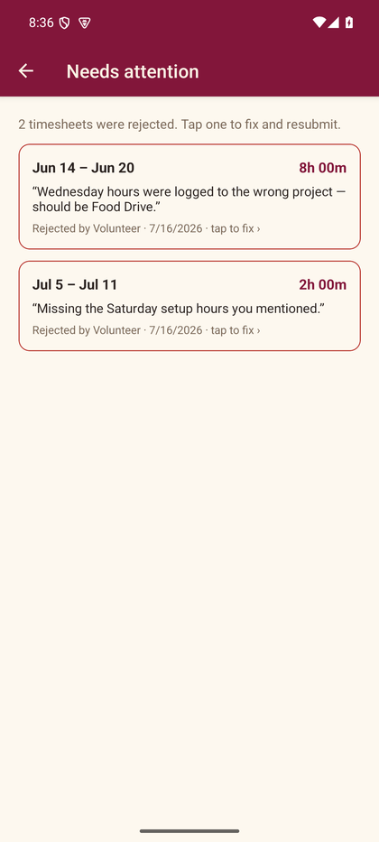

If your approver rejects a week, a **red banner appears on Home**. Tap it to
open **Needs attention** — a single list of every rejected week (even from
months back), each showing the approver's reason, who rejected it, and when.

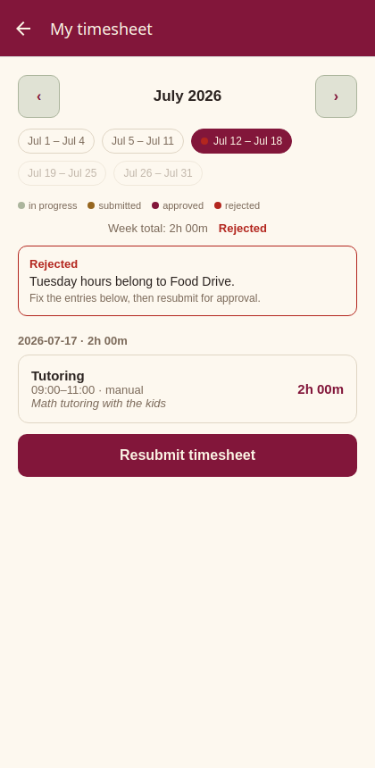

Tap a row and you land on that week, with the reason at the top:

1. Fix the entries the reason points at (tap to edit, add what's missing).
2. Tap **Resubmit timesheet**. It goes back to your approver, and the item
   disappears from Needs attention.

## 1.8 After approval

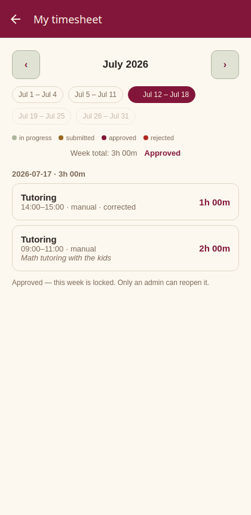

An approved week shows **Approved** and is locked for everyone — that's what
makes it official. Spot a mistake after approval? Ask an **admin** to reopen
the week; it returns to draft and goes through submit → approve again.

## 1.9 Notifications

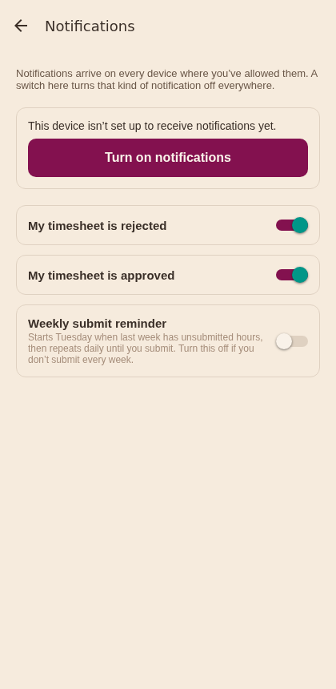

The app sends push notifications so nothing sits unnoticed:

- **Your timesheet was rejected** (with the reason) or **approved**.
- *Approvers:* someone **submitted or resubmitted** a timesheet to you.
- *Admins:* a **new account** is waiting for approval.
- A **submit reminder** — if last week has logged hours that were never
  submitted (or a rejected sheet), you get a nudge on **Tuesday morning** in
  your local timezone, and then **daily** until you submit it. Weeks with
  nothing to submit don't nag.

The app asks for notification permission when you sign in — allow it on each
device where you want them. Home → **Notification settings** lets you switch
each kind off individually; the **weekly reminder has its own switch**, so
people who don't submit every week can silence the nagging while keeping the
important notifications on.

Notifications follow the account signed in on the device: signing out stops
this phone or browser from receiving that account's notifications.

## 1.10 Switching accounts / signing out

**Sign out** is at the bottom of Home. Signing out fully clears your Google
session in the app, so the next sign-in always shows Google's account chooser —
that's how you switch between accounts.

---

# Part 2 — For managers & approvers

Managers see three extra buttons on Home — **Approvals**, **Reports**, and
**Activities** — plus **Manage users** (approver assignment).

## 2.1 Approving timesheets

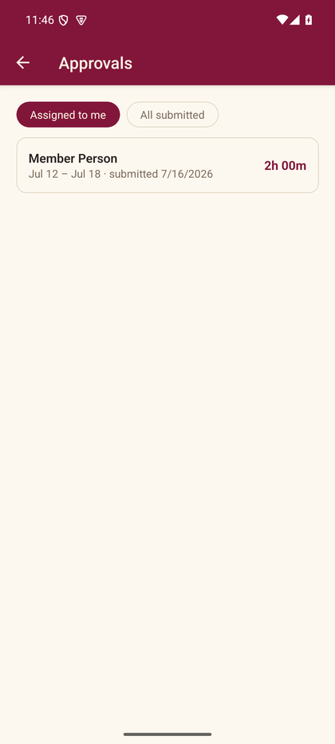

Home → **Approvals**. The badge on the button shows how many submissions are
waiting for *you* (you see the sheets whose submitters picked you as their
approver; admins also get an "All submitted" toggle to see everyone's queue).

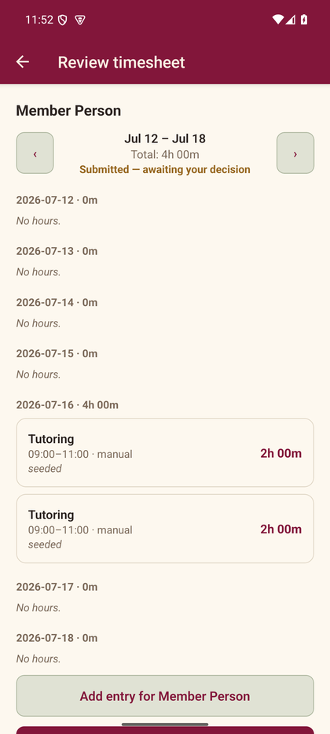

Tap a submission to review it:

- Every day of the week is laid out Sunday→Saturday, including empty days —
  so missing days are as visible as logged ones.
- **Tap any entry to correct it** (times, activity, note) — your edit is
  flagged "corrected" on the entry.
- **Add entry for {name}** logs hours on the person's behalf (e.g. they forgot
  their Saturday setup hours).
- Then either:
  - **Approve timesheet** — the week becomes official and locks, or
  - type a reason and **Reject timesheet** — it returns to the owner, who sees
    your reason word for word. A reason is required; "fix it" helps nobody.

Use the **‹ › arrows** on this screen to step through the person's other
weeks — you can review or correct any non-approved week, not just the
submitted one.

## 2.2 Browsing someone's timesheets (before they submit)

Reports → tap a person in the **By person** list → **View timesheets**. Same
week-by-week view as above — handy mid-week to see how someone's week is
shaping up, or to add hours they forgot, without waiting for a submission.

## 2.3 Activities

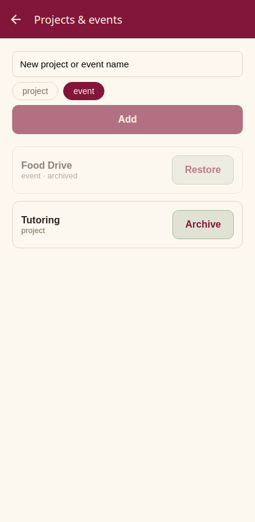

Home → **Activities**. Create the activities people log hours against — a
name is all it takes, whether it's an ongoing program ("Tutoring") or a
one-off event ("Food Drive").

Activities are never deleted — **archive** them instead. Archived activities
disappear from pickers but keep their history in every report. **Restore**
brings one back.

## 2.4 Reports & exports

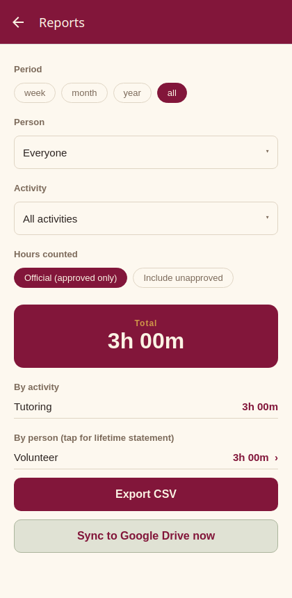

Home → **Reports**:

- **Period** — this week / this month / this year / all time.
- **Person / Activity** — searchable filters; default is everyone/everything.
- **Hours counted** — the important switch:
  - **Official (approved only)** — the default. Only hours from *approved*
    timesheets. This is the number for the board, grants, and records.
  - **Include unapproved** — adds hours still awaiting approval (marked
    unofficial; CSV exports get an `_unofficial` filename so nobody mistakes
    them).
- **Export CSV** — downloads the filtered entries with person, email,
  activity, date, times, timezone, and hours per row.
- **Sync to Google Drive now** — pushes the shared Google Sheet (once Drive
  sync is configured by the admin).

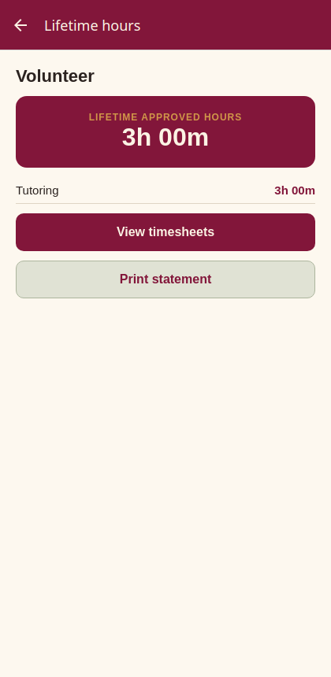

Tapping a person shows their lifetime approved hours by activity, plus
**Print statement** (on the website) — a clean printable statement of their
volunteer hours, e.g. for school credit letters.

### A note on timezones

Every entry remembers *where* it happened. Someone working 9:00–17:00 in
Singapore shows 9:00–17:00 on the correct day for every viewer — reports never
shift hours into the viewer's timezone.

---

# Part 3 — For admins

Admins manage people. On Home: **Manage users** (admins also see Approvals —
an admin can approve or reject *any* submitted timesheet, and self-approves
their own).

## 3.1 Approving new users

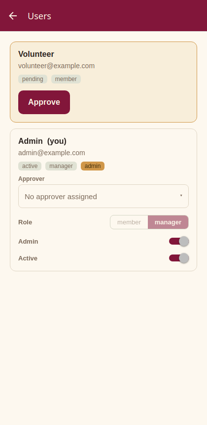

When someone signs in for the first time they appear in **Manage users** with a
gold *pending* card showing their name and email — the Home button reads
**"Manage users (1)"** while requests are waiting, and admins get a push
notification. Tap **Approve** and their screen unlocks live, wherever they are.

## 3.2 Managing a user

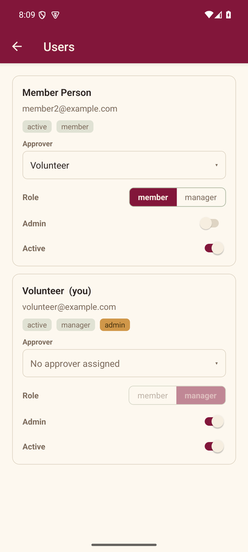

Each active user's card shows their state directly:

- **Approver** — who approves their timesheets. Set it here, or let them pick
  their own on their home screen. (Managers can set this for non-admins too.)
- **Role: member | manager** — managers get Approvals, Reports, and
  Activities.
- **Admin** — the full-control switch (see below).
- **Active** — turn off to disable an account: they're locked out immediately
  and can't log hours. Turn back on to restore. Nothing is ever deleted.

Every change asks for confirmation, so a stray tap can't promote or disable
anyone. You cannot demote, disable, or un-admin **yourself** — so the
organization can never lock itself out.

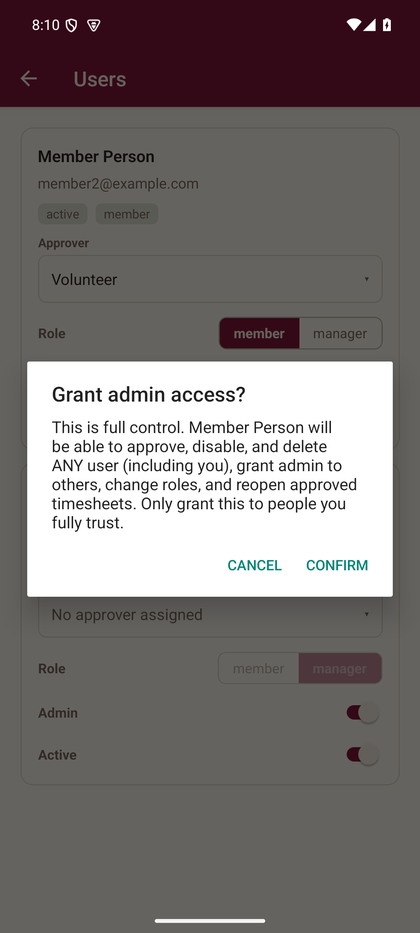

**Grant admin sparingly.** As the dialog says: an admin can approve, disable,
and manage *any* user, grant admin to others, change roles, and reopen
approved timesheets. Admin is different from manager — a manager runs the
operation (activities, reports, approvals); an admin controls the people.

## 3.3 Reopening an approved timesheet

Approved weeks are locked for everyone — except that an admin can **reopen**
one: open the person's week (Reports → person → View timesheets, or your own
in My timesheet) and tap **Reopen (admin)**. The week returns to draft; the
owner fixes it and it goes through submit → approve again. Use it for genuine
mistakes discovered after the fact.

## 3.4 Odds and ends

- **First admin** of the system is created once during deployment; every
  further admin is granted in-app with the Admin switch.
- **Google Drive sync** (live Sheet + monthly CSV snapshots) requires a
  one-time setup by the developer/admin; until then the "Sync to Drive" button
  reports it isn't connected yet, harmlessly.
- **Error banner**: if a red "Live data error" bar ever appears at the top of
  a screen, the app couldn't load live data (permissions or connectivity).
  It's also reported automatically to the error dashboard — tell the developer,
  mentioning what you were doing.

---

# Part 4 — "How do I…?" quick answers

**…log the hours I worked right now?**
Home → pick the activity → Clock in → work → Clock out.

**…log yesterday's hours?**
Home → Add hours manually → date "Yesterday" → set times → Save hours.

**…fix a wrong entry?**
Home → My timesheet → open the week → tap the entry → change → Save changes.

**…delete an entry?**
Tap the entry, then **Delete entry**.

**…submit my week?**
My timesheet → check the week → Submit timesheet. (Clock out first; pick an
approver once if you haven't.)

**…submit a week I missed a while ago?**
My timesheet → ‹ back to its month, tap its week chip → Submit. Old weeks have
no deadline. Empty weeks can be submitted as "(no hours)".

**…add more hours after I submitted?**
Withdraw submission (while it's still awaiting approval) → add hours →
Submit again. If it was already approved, ask an admin to reopen it.

**…see why my timesheet was rejected, and fix it?**
Tap the red banner on Home → tap the rejected week → read the reason → fix
entries → Resubmit timesheet.

**…change who approves my timesheets?**
Home → My timesheet approver → pick someone else. Applies from your next
submission.

**…sign in with a different Google account?**
Sign out (bottom of Home) → Sign in with Google → the account chooser appears.

**…stop the weekly reminder without losing other notifications?**
Home → Notification settings → switch off **Weekly submit reminder**.

**…approve or reject someone's week?** *(managers)*
Home → Approvals → tap the submission → Approve, or type a reason and Reject.

**…add hours for someone who forgot?** *(managers)*
Approvals → their submission → "Add entry for {name}". Or before they submit:
Reports → the person → View timesheets → Add entry.

**…create a new activity?** *(managers)*
Home → Activities → name it → Add.

**…get official hours for a grant report?** *(managers)*
Reports → set the period → keep "Official (approved only)" → Export CSV.

**…print a volunteer's hours statement?** *(managers, website)*
Reports → tap the person → Print statement.

**…let a new team member in?** *(admins)*
They sign in once with Google → Manage users → Approve on their pending card.

**…make someone a manager / an admin?** *(admins)*
Manage users → their card → flip Role to manager, or the Admin switch →
confirm the dialog.

**…disable someone who left?** *(admins)*
Manage users → their card → Active switch off → confirm. Their history stays.

**…fix an already-approved week?** *(admins)*
Open that week → Reopen (admin) → the owner fixes and resubmits.

---

## Troubleshooting

| What you see | What it means | What to do |
|---|---|---|
| "Almost there" screen after signing in | Your account awaits admin approval | Ask your admin; the screen unlocks by itself once approved |
| "Pick your timesheet approver…" when submitting | No approver chosen yet | Home → My timesheet approver → pick one |
| "This week's timesheet is submitted/approved…" when clocking in | The current week is locked | Withdraw the submission (or ask an admin to reopen an approved week) |
| "Clock out before submitting this week" | A session is still running | Clock out, then submit |
| An entry is outlined red: "Overlaps another entry" | Two entries on that day have overlapping times | Tap one and fix its times; submission unlocks once no entries overlap |
| No push notifications arriving | Permission not granted on this device, or that kind is switched off | Allow notifications when the app asks (or in system settings), and check Home → Notification settings |
| Red "Live data error" bar | The app couldn't load live data | Check connectivity; if it persists, tell the developer — it's also auto-reported |
| A week chip has a red dot | That week was rejected | Tap the red banner on Home → fix → resubmit |

*Manual source: `docs/USER-MANUAL.md` (images in `docs/manual/img/`). PDF:
`docs/USER-MANUAL.pdf`. Update both together when the app changes.*
